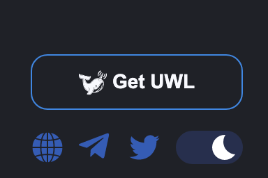

# Cielo Feed

Upon successfully connecting to [app.cielo.finance](https://app.cielo.finance/) you will be taken to your Feed. This is your mission control. It contains a stream of the latest transactions from wallets you’re already following with the EVM Wallet Tracker bot.

<figure><figcaption>
Cielo Feed, dark.
</figcaption></figure>

<figure><figcaption>
Cielo Feed, light.
</figcaption></figure>

If you are a Cielo Pro member, a maximum of one bot can appear in your Feed. If you are a Whale member, up to three bots can appear.

Before we explain how the Feed works, let’s begin with the buttons on the periphery of the screen.

The icon on the top right denotes that your wallet is connected. Clicking on it will reveal your subscription status (Pro or Whale) and wallet address. If you wish to change wallets or disconnect from Cielo altogether, click **Disconnect**.

On the far left of the screen, the collapsed Cielo menu contains four icons. Click anywhere in the left menu or on the dual arrow icon to expand it. You will then see the following options:

<figure><figcaption></figcaption></figure>

**Feed**: Main Cielo dashboard to view your tx stream and apply filters.

**Customize**: Control center for adjusting your bot settings and editing Lists.

**Research**: Read exclusive Cielo content and onchain analysis.

**Bridge Trackers**: Follow capital in- and outflows through five EVM networks.

This guide will focus on the first two options since they control your Cielo experience: **Feed** and **Customize**.

In the footer of the left hand menu, there are options to toggle between light and dark mode, buy UWL, and follow Cielo’s social channels.

<figure><figcaption></figcaption></figure>
