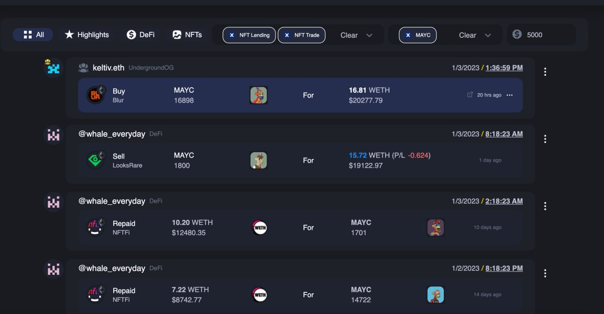
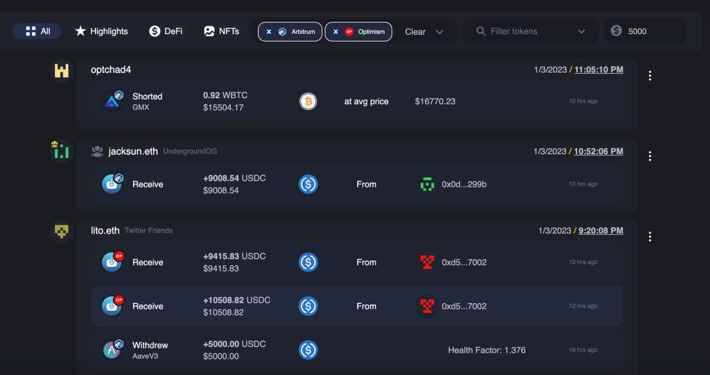
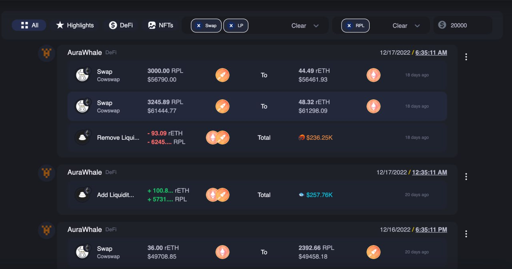

# Filtering

Cielo provides a range of ways to filter and segment the signals you receive. Not only does this prevent information overload, but it makes it easier to discern trends for verticals that you’re interested in such as _NFTs_ or _DeFi_.

The top menu for your Feed looks like this:

<figure><figcaption></figcaption></figure>

When clicking the **All** tab, you can filter your Feed to show tx for a particular List. If you’re a new Cielo user, only option is available: **All**. This populates your Cielo feed with all of the wallets that you’re currently following with the Cielo Wallet Tracker bot.

In the image above, the user has imported a number of dynamic Lists such as _NewWhaleWallets_. Selecting this option from the dropdown menu will populate their Feed with tx solely pertaining to this List. Switching back to **All** returns the Feed to its default state.

We’ll explain how to create your own custom List in the [following section.](../lists/) But first, here are some preset filters you can apply to make sense of your Feed.

<figure><figcaption></figcaption></figure>

Click on the different icons to filter the tx that the Cielo Feed displays.

**All**: the default setting for your Feed, set to show all tx.

**Highlights**: displays noteworthy tx only, typically recent high value transactions.

**DeFi**: displays DeFi swaps, loans and other trading activity.

**NFTs**: displays NFT mints, trades, and loans.

**Filter Tx types and Chains:** Clicking on this produces a dropdown menu containing options to filter tx as follows:

* Specific EVM networks (e.g. _Avalanche, Ethereum_)
* Single tx types (_swap, LP, lending, NFT lending, perp, option, NFT trade, NFT mint, NFT transfer, NFT liquidation, SudoPool Creation, Other_)

<figure><figcaption></figcaption></figure>

In the image above, Polygon has been selected. Click on **Clear** to revert the Feed to displaying all transactions.

## Filtering by tokens and transaction size

The final two option in the top menu of your Cielo Feed allow you to filter by token type and transaction size.

<figure><figcaption></figcaption></figure>

* **Filter tokens:** Enter the name of a particular token and you will only be shown recent tx involving that token in your Feed.
* **Min USD:** Enter a USD amount (minimum: **1,000**) and you'll only be shown tx that meet or exceed that threshold.


**Note**: You can mix and match filters to show multiple search parameters e.g. _Avalanche **+** Ethereum **+** NFT lending **+** perps **+** ETH._


Any time you wish to clear your filters, just click the small **x** alongside the filter in question. The screenshots below show examples of how you can use filters to enhance your Cielo Feed.

<figure><figcaption>
Filtering for NFT trades and lending involving the MAYC collection.
</figcaption></figure>

<figure><figcaption>
Filtering for trades that occur on Arbitrum and Optimism only.
</figcaption></figure>

<figure><figcaption>
Filtering for swaps and LPs involving the RPL token.
</figcaption></figure>

## Summary

Your Cielo feed is a powerful tool for viewing onchain transactions and making sense of them at a glance. These could be your own trades, those of influencers you’re following, or of an entire sector you’re trying to monitor e.g. onchain perps.

Using the basic filters that appear at the top of your Feed, you can quickly burrow deeper into areas of interest, be it a particular blockchain, transaction type, wallet, or theme. The greatest Cielo features, however, which make it the most granular and versatile dashboard of its kind, can be found under [**Customize**](../customize.md). Here, with a few smart selections, you can control multiple feeds to suit your mood, interests, and needs.
