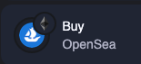
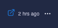

# Navigation

Your feed will look something like this:

<figure><figcaption></figcaption></figure>

Cielo displays transactions chronologically and groups them by date and time for ease of comprehension. A cluster of tx from one wallet within the space of a few minutes, for instance, will be grouped together.

The small circular icon superimposed over a larger circular icon on the left of each row denotes the network where the tx took place. For instance, an Ethereum logo superimposed over an OpenSea logo shows that the transaction occurred on Ethereum network on OpenSea marketplace. Other icons used to distinguish tx types include those for funds sent, received, and smart contract interactions.

<figure><figcaption></figcaption></figure>

Above each wallet you can see the name you have assigned to the wallet, or the ENS or label assigned if it’s a known wallet. Clicking on the wallet name or the accompanying icon opens a page containing all of the recent tx made by that address. This is useful when trying to glean more information on a particular trader. Thanks to Cielo’s smart labeling system, deciphering a stream of onchain interactions is much easier than with a block explorer.

Your Feed assigns labeling and data to each transaction to aid your understanding. For instance, it will tell you the DEX or market where the tx occurred, the value of the transaction both in USD and the native currency (e.g. ETH), and the elapsed time since the tx took place. Where available, icons are displayed for the market (e.g. OpenSea), and the currency (e.g. USDC). If an NFT was purchased, a thumbnail will also be shown.

Hover over the NFT thumbnail and you will see the following:

<figure><figcaption></figcaption></figure>

Click on one of the thumbnails to view the NFT on your desired market or select **Explore** to view the entire NFT collection in Cielo.

To view the tx in a blockchain explorer, move your cursor to the end of the row and click on the small icon that appears:

<figure><figcaption></figcaption></figure>

Clicking on the three horizontal dots produces a pop-up with the option to tweet about the transaction. The tweet will auto-populate with the tx details and you can add your own commentary before posting.

Where a wallet has generated multiple tx in quick succession that are very similar, Cielo conceals the remainder behind a dropdown tab:

<figure><figcaption></figcaption></figure>

In the example above, four tx have occurred but only the master tx is displayed. Clicking on the arrow to the right expands the menu to reveal the following:

<figure><figcaption></figcaption></figure>

Click the up arrow to collapse the menu once more.

To the right of each wallet cluster there are three vertical dots. Clicking on these produces the following options:

<figure><figcaption></figcaption></figure>

Select **View Profile** to open a Feed displaying all tx for that wallet. Selecting **Edit Item** takes you to **Customize** where you can adjust the label and other parameters for this wallet. For more information on this, see [**Customize**](../customize.md).
