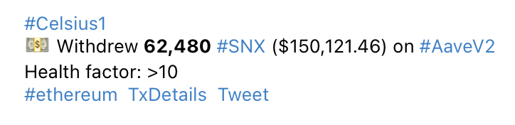

# Labeling

To aid comprehension, the EVM Wallet Tracker automatically labels tx involving known tokens, DEXs, lending platforms, NFT collections, bridges, and other DeFi protocols. This makes it easier to understand which asset is being used by whom, where, and why. For instance:

<figure><figcaption></figcaption></figure>

This transaction shows that a known entity (Celsius) has withdrawn the SNX token from Aave’s lending platform. The labeling also reveals the borrower’s current health score on Aave (>10) and the network on which the tx occurred – Ethereum.

Clicking on one of the hashtags e.g. _#SNX_ will reveal all instances of similar transactions appearing in your EVM Wallet Tracker channel. In addition, clicking on _TxDetails_ will open a link to the corresponding blockchain transaction in a relevant explorer such as Etherscan for Ethereum.

Clicking on _Tweet_ will open a Twitter window that populates with the transaction details, like this:

<figure><figcaption></figcaption></figure>

Edit the message if you like and then hit Tweet to publish to Twitter. This feature is useful when providing commentary on whale movements, major hacks, and other onchain drama that you wish to analyze and share with your followers.
