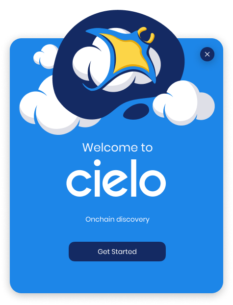
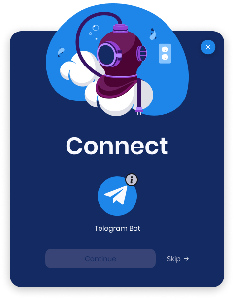
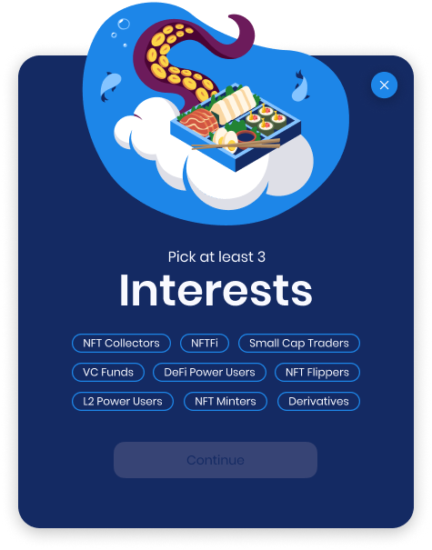

# Getting started

Visit[ app.cielo.finance](https://app.cielo.finance/) and you’ll see the Cielo web app in preview mode. This mode displays recent transactions from a preselected number of wallets. While in preview, you can navigate through Cielo using the links in the left sidebar and apply filters from the dropdown menus at the top of the page.\

The primary pages that form the Cielo web app are as follows:

[**Feed**](https://app.cielo.finance/feed): This is where recent transactions are displayed. It’s your window into the world of onchain activity and is populated with wallets you’re following.

[**NFTs**](https://app.cielo.finance/nft/trending): Explore NFT collections and view useful statistics on floor prices, top traders, and much more.

[**Explore**](https://app.cielo.finance/explore): Discover themed lists created by Cielo users and follow lists of interest

[**Configure**](https://app.cielo.finance/configure): This is where you add wallets, create lists, and control settings for the accompanying Cielo Wallet Tracker Telegram bot.

[**Stats**](https://app.cielo.finance/stats): View analytics for the wallets, tokens, and networks you’re tracking. This feature is only available to Pro + Whale tier users.

<figure><figcaption>
Cielo web app in preview mode
</figcaption></figure>

To fully access Cielo and populate the dashboard with wallets of your choice you need to connect your web wallet. To do so, click the **Connect** button at the bottom of the page. This will initiate the onboarding tutorial.

<figure><figcaption>
Connecting to Cielo for the first time.
</figcaption></figure>

<figure><figcaption></figcaption></figure>

Click **Get Started** and you will be prompted to connect using MetaMask or Wallet Connect. Your web wallet will then ask you to sign a message confirming you wish to log in to Cielo.

<figure><figcaption>
MetaMask tx signing prompt
</figcaption></figure>


Note: Signing this transaction does not authorize Cielo to access any assets in your wallet. Its sole function is to verify that you control the wallet.


<figure><figcaption></figcaption></figure>

You will now be asked to connect to the Cielo Wallet Tracker bot via Telegram. Select **Skip** if you have no desire to do so. However, to enjoy the full Cielo experience, it is recommended that you complete this step.

If you are an existing user of the Cielo Wallet Tracker, this will pair the Telegram bot with the wallet you have just used to authenticate. If you have never used the Cielo Wallet Tracker, this will initiate the bot and pair it with your web wallet.

Click the Telegram icon and a link will open in Telegram. Follow the instructions within the Telegram bot to complete this stage and then return to Cielo and click Continue.

<figure><figcaption></figcaption></figure>

\
The onboarding tutorial will now start. This consists of a series of pop-ups that display options for personalizing your Cielo feed and guide you through using the platform. It’s recommended that you complete the tutorial, which takes around 60 seconds. If you wish to skip this step, however, click **x**. You can always revisit the tutorial later from the link in the left menu.

Once the tutorial has completed, you should have a good idea of how Cielo works. We will now proceed to explore each of these pages and features in turn.

\
